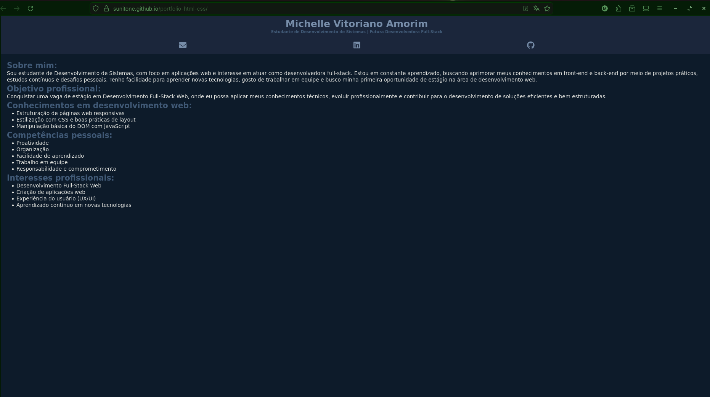

# Portfólio Pessoal – HTML & CSS

Este projeto é um portfólio pessoal desenvolvido com **HTML e CSS**.  
Ele foi criado com o objetivo de praticar conceitos fundamentais de desenvolvimento web e servir como base para um portfólio profissional.

---

## 📸 Preview

---

## 🛠️ Tecnologias utilizadas
- HTML5
- CSS3
- Flexbox
- Font Awesome

---

## 🎯 Objetivo do projeto
- Praticar estruturação semântica com HTML
- Aplicar estilização e boas práticas com CSS
- Criar um portfólio simples para apresentação profissional

---

## 🚀 Como visualizar o projeto
Se estiver usando o **GitHub Pages**, acesse:
https://sunitone.github.io/portfolio-html-css/

Ou:
1. Clone o repositório
2. Abra o arquivo `index.html` no navegador

---

## 📚 Aprendizados
- Organização de arquivos em projetos front-end
- Uso de variáveis CSS
- Integração com ícones usando Font Awesome
- Versionamento de código com Git e GitHub

---

## ✨ Próximas melhorias
- [ ] Criar novas seções (projetos, contatos)
- [ ] Melhorar acessibilidade

---

## 👩‍💻 Autora
**Michelle Vitoriano Amorim**  
Estudante de Desenvolvimento de Sistemas  
Futura Desenvolvedora Full-Stack Web 🚀
